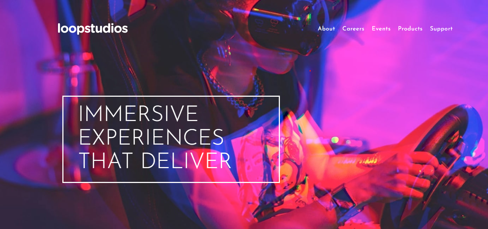

# Frontend Mentor - Space tourism website solution

This is a solution to the [Loopstudio website challenge on Frontend Mentor](https://www.frontendmentor.io/challenges/loopstudios-landing-page-N88J5Onjw). Frontend Mentor challenges help you improve your coding skills by building realistic projects. 

## Table of contents

- [Overview](#overview)
  - [The challenge](#the-challenge)
  - [Screenshot](#screenshot)
  - [Links](#links)
- [My process](#my-process)
  - [Built with](#built-with)
  - [What I learned](#what-i-learned)
- [Author](#author)

## Overview

### The challenge

Users should be able to:

- View the optimal layout for each of the website's pages depending on their device's screen size
- See hover states for all interactive elements on the page
- View each page and be able to toggle between the tabs to see new information

### Screenshot

### Links

- Solution URL: [https://github.com/Natiman1/loop-studio]
- Live Site URL: [https://loop-studio-sand.vercel.app/]

## My process

### Built with

- Semantic HTML5 markup
- CSS custom properties
- Flexbox
- Grid
- Mobile-first workflow
- TypeScript
- [React](https://reactjs.org/) - JS library
- [Tailwind CSS](https://tailwindcss.com/) - For
 styles

### What I learned

While building this project i want to try new things so i decide to use TypeScript, Tailwind CSS and it's the first time to me using this technologies that's quiet challenging but i learn a lot of things. And continue learning in futuer projects

## Author

- Frontend Mentor - [@Natiman1](https://www.frontendmentor.io/profile/Natiman1)

